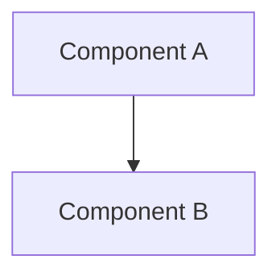
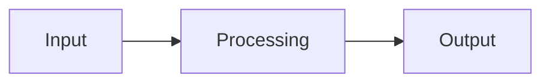

# {{TITLE}}

## Overview
Brief description of the component and its role in the system.

## Architecture

Use Mermaid diagrams to illustrate structure and flow — prefer over ASCII art or prose-only descriptions.

### Components
Describe the major components and their responsibilities.

### Data Flow
How data moves through the system.

### Interfaces
Public APIs, events, or contracts.

## Design Decisions

### Decision 1: [Title]
**Context:**
**Options Considered:**
1.
2.
**Decision:**
**Rationale:**

## Error Handling
How errors are detected, reported, and recovered from.

## Testing Strategy
How the design will be validated.

### Structural Verification
Language-specific checks beyond tests (see `shared/language-verification.md`).

## Migration / Rollout
How to transition from current state to the new design.
